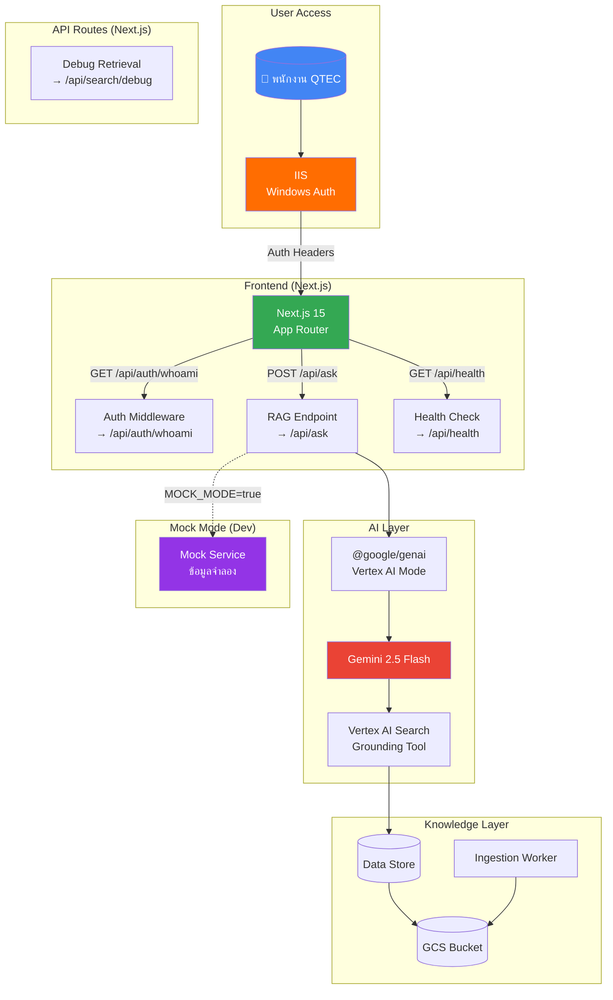
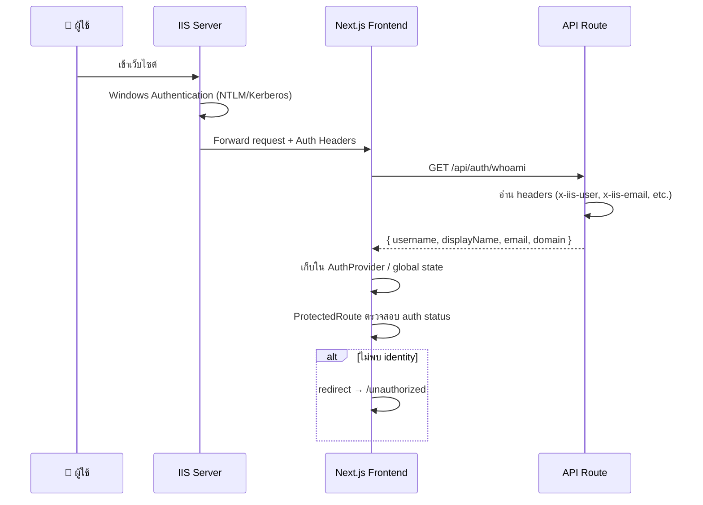

# QTEC Enterprise Managed RAG (The Brain) — Complete Implementation Plan

## Overview

โปรเจคนี้คือ **Enterprise Managed RAG PoC** สำหรับ QTEC — เว็บไซต์ที่พนักงานถามคำถามเกี่ยวกับเอกสารองค์กร (HR policy, SOP, manual) แล้วได้คำตอบ grounded จากข้อมูลจริง

| Decision | Choice |
|----------|--------|
| Backend | Next.js API Route only (ไม่แยก Express) |
| Auth | Windows Authentication via IIS → `whoami` endpoint |
| UI Language | ไทยเป็นหลัก |
| Deployment | Google Cloud Run 100% |
| Discovery Engine | **ยังปิดอยู่** → ใช้ Mock Mode สำหรับ dev/test |

**Tech Stack:** Next.js 15 (App Router, TypeScript) · `@google/genai` · Vertex AI Search · Cloud Run · IIS Windows Auth

---

## System Architecture



---

## Authentication Flow (Windows Auth via IIS)



**IIS Headers ที่ backend จะอ่าน:**

| Header | ค่าตัวอย่าง | คำอธิบาย |
|--------|------------|----------|
| `x-iis-auth-user` | `QTEC\somchai.s` | Windows username (domain\user) |
| `x-iis-auth-displayname` | `สมชาย สุขใจ` | Display name |
| `x-iis-auth-email` | `somchai.s@qtec.co.th` | Email |
| `x-iis-auth-domain` | `QTEC` | Domain name |

> [!NOTE]
> Header names อาจเปลี่ยนตาม IIS config จริง — ทำเป็น configurable ผ่าน env vars

---

## Mock Mode System

เนื่องจาก Discovery Engine API ยังเปิดไม่ได้ ระบบจะมี **Mock Mode** สำหรับ dev/test:

```
MOCK_MODE=true    # เปิด mock
MOCK_MODE=false   # ใช้ Vertex AI จริง (default)
```

**Mock Mode จะ:**
- `/api/ask` → คืนคำตอบจำลองจาก mock data พร้อม sources จำลอง
- `/api/health` → คืน `ok: true` พร้อม `mock: true` flag
- `/api/search/debug` → คืน mock chunks/snippets
- `/api/auth/whoami` → คืน mock user (configurable)

**Mock Data ตัวอย่าง (Thai):**
```json
{
  "question": "นโยบายการลาพักร้อนเป็นอย่างไร",
  "answer": "ตามนโยบาย HR-POL-001 พนักงานประจำมีสิทธิ์ลาพักร้อนปีละ 6-15 วัน ตามอายุงาน...",
  "sources": [
    { "title": "HR-POL-001 นโยบายการลา", "snippet": "..." }
  ]
}
```

---

## Project Folder Structure

```
vertex_search/
├── src/
│   ├── app/
│   │   ├── layout.tsx                # Root layout + fonts + metadata
│   │   ├── page.tsx                  # หน้าแชทหลัก
│   │   ├── globals.css               # Design system + theme
│   │   ├── unauthorized/
│   │   │   └── page.tsx              # หน้า fallback เมื่อไม่ auth
│   │   ├── dashboard/
│   │   │   └── page.tsx              # แดชบอร์ดสถานะระบบ
│   │   └── api/
│   │       ├── auth/
│   │       │   └── whoami/
│   │       │       └── route.ts      # GET — ข้อมูล identity ผู้ใช้
│   │       ├── ask/
│   │       │   └── route.ts          # POST — RAG endpoint หลัก
│   │       ├── health/
│   │       │   └── route.ts          # GET — health check
│   │       └── search/
│   │           └── debug/
│   │               └── route.ts      # POST — debug retrieval
│   ├── components/
│   │   ├── chat/
│   │   │   ├── ChatInterface.tsx     # Container แชท
│   │   │   ├── MessageBubble.tsx     # ฟองข้อความ (user/AI)
│   │   │   ├── QuestionInput.tsx     # ช่องพิมพ์คำถาม
│   │   │   └── SourceCitation.tsx    # แหล่งอ้างอิง
│   │   ├── layout/
│   │   │   ├── Header.tsx            # Header + user info
│   │   │   └── Sidebar.tsx           # Navigation
│   │   ├── dashboard/
│   │   │   ├── HealthCard.tsx        # สถานะระบบ
│   │   │   └── MetricsPanel.tsx      # Latency & metrics
│   │   ├── auth/
│   │   │   ├── AuthProvider.tsx      # Context provider สำหรับ auth
│   │   │   ├── ProtectedRoute.tsx    # Guard component
│   │   │   └── UserBadge.tsx         # แสดงชื่อผู้ใช้
│   │   └── ui/
│   │       ├── Button.tsx
│   │       ├── Card.tsx
│   │       ├── Loading.tsx
│   │       └── Badge.tsx
│   ├── lib/
│   │   ├── genai.ts                  # Google Gen AI client singleton
│   │   ├── config.ts                 # Env config + validation
│   │   ├── prompts.ts                # System prompts & guardrails
│   │   ├── types.ts                  # TypeScript interfaces
│   │   ├── auth.ts                   # Auth header parsing utility
│   │   └── mock/
│   │       ├── mockService.ts        # Mock RAG responses
│   │       └── mockData.ts           # ข้อมูลจำลองภาษาไทย
│   └── hooks/
│       ├── useChat.ts                # Chat state hook
│       ├── useAuth.ts                # Auth state hook
│       └── useHealth.ts              # Health polling hook
├── docs/
│   ├── architecture.md               # Architecture deep-dive
│   ├── api-contract.md               # API contract
│   ├── auth-flow.md                  # Windows Auth flow detail
│   ├── prompt-policy.md              # Prompt & guardrails
│   ├── ingestion-guide.md            # Ingestion pipeline
│   └── evaluation-framework.md       # Test set & metrics
├── Dockerfile                        # Cloud Run container
├── .dockerignore
├── cloudbuild.yaml                   # Cloud Build config (optional)
├── .env.example
├── .env.local
├── next.config.ts
├── package.json
└── README.md
```

---

## Proposed Changes — Key Components

### A. Authentication

#### [NEW] `src/lib/auth.ts` — Header Parsing

```typescript
// อ่าน IIS auth headers จาก request
// Parse domain\username format
// Return AuthUser object หรือ null
// Header names configurable ผ่าน env vars
```

#### [NEW] `src/app/api/auth/whoami/route.ts`

```typescript
// GET /api/auth/whoami
// อ่าน IIS headers → คืน { username, firstname, lastname, displayName, email, domain }
// Mock mode → คืน mock user
// ไม่พบ identity → 401 { ok: false, error: "ไม่สามารถระบุตัวตนได้" }
```

#### [NEW] `src/components/auth/AuthProvider.tsx`

```typescript
// React Context สำหรับ auth state
// เรียก GET /api/auth/whoami ตอน mount
// เก็บ user data ใน context
// Expose: user, isAuthenticated, isLoading
```

#### [NEW] `src/components/auth/ProtectedRoute.tsx`

```typescript
// Wrapper component ตรวจ auth status
// ถ้า loading → แสดง loading skeleton
// ถ้าไม่ authenticated → redirect /unauthorized
// ถ้า authenticated → render children
```

#### [MODIFY] `src/components/auth/UserBadge.tsx` — Settings & Help Dropdown
- Import DropdownMenu components from Radix UI (or build a custom Vanilla CSS/State dropdown).
- Wrap the existing `user.displayName` button in a dropdown trigger.
- Add menu items for:
  - **การตั้งค่า (Settings)** -> Opens a modal or dummy page for future preferences.
  - **สลับโหมดหน้าจอ (Theme)** -> Placeholder for Dark/Light mode toggle.
  - **คู่มือการใช้งาน (Help/Guide)** -> Opens a modal with prompt guide.
  - **แจ้งปัญหา (Report Issue)**

---

### B. RAG API (with Mock Mode)

#### [NEW] `src/app/api/ask/route.ts`

```typescript
// POST /api/ask
// ถ้า MOCK_MODE=true → ใช้ mockService
// ถ้า MOCK_MODE=false → เรียก Gemini + Vertex AI Search grounding
// Response: { ok, answer, sources[], grounded, model, requestId, latencyMs }
```

#### [NEW] `src/lib/mock/mockService.ts`

```typescript
// จำลอง RAG responses สำหรับ dev/test
// Match question keywords → return mock answers
// Simulate latency (500-1500ms)
// Return mock sources with Thai content
```

#### [NEW] `src/lib/mock/mockData.ts`

```typescript
// ชุดข้อมูลจำลองภาษาไทย เช่น:
// - นโยบายการลา (HR-POL-001)
// - ระเบียบค่าล่วงเวลา (HR-POL-005)
// - คู่มือความปลอดภัย (SAF-MAN-001)
// - ขั้นตอนการเบิกพัสดุ (PRO-SOP-003)
```

---

### C. Frontend (Thai UI)

#### [NEW] `src/app/page.tsx` — หน้าแชทหลัก

- Hero: **"QTEC Knowledge Brain — ผู้ช่วยค้นหาความรู้องค์กร"**
- คำถามตัวอย่าง (chips): "นโยบายการลาพักร้อน", "ขั้นตอนเบิกค่า OT", "คู่มือความปลอดภัย"
- Chat interface เต็มหน้าจอ
- แสดงชื่อผู้ใช้ที่มุมขวาบน

#### [NEW] Design System (globals.css)

| Token | Value | ใช้สำหรับ |
|-------|-------|----------|
| `--bg-primary` | `#0f172a` | พื้นหลังหลัก (dark) |
| `--bg-card` | `rgba(30,41,59,0.8)` | Glass card |
| `--accent` | `#3b82f6` | ปุ่ม, link |
| `--accent-hover` | `#60a5fa` | Hover state |
| `--success` | `#10b981` | สถานะสำเร็จ |
| `--warning` | `#f59e0b` | สถานะเตือน |
| `--text-primary` | `#f8fafc` | ข้อความหลัก |
| Font | Inter | Google Fonts |

---

### D. Cloud Run Deployment

#### [NEW] `Dockerfile`

```dockerfile
# Multi-stage build
# Stage 1: Install dependencies + build Next.js
# Stage 2: Production image (node:20-alpine)
# Expose port 8080 (Cloud Run default)
# CMD: node server.js (standalone output)
```

#### [NEW] `next.config.ts` update

```typescript
// output: 'standalone' สำหรับ Cloud Run
// serverExternalPackages: ['@google/genai']
```

---

### E. Environment Variables

```env
# === App ===
NEXT_PUBLIC_APP_NAME=QTEC Knowledge Brain
MOCK_MODE=true                          # เปิด mock สำหรับ dev

# === Google Cloud ===
GOOGLE_CLOUD_PROJECT=aix-communication-hub
GOOGLE_CLOUD_LOCATION=us-central1

# === Vertex AI Search ===
DATA_STORE_ID=your-data-store-id        # ใส่จริงเมื่อพร้อม
DATA_STORE_LOCATION=global

# === Model ===
MODEL_NAME=gemini-2.5-flash

# === Auth Headers (customizable) ===
AUTH_HEADER_USER=x-iis-auth-user
AUTH_HEADER_DISPLAYNAME=x-iis-auth-displayname
AUTH_HEADER_EMAIL=x-iis-auth-email
AUTH_HEADER_DOMAIN=x-iis-auth-domain

# === Mock Auth (for dev) ===
MOCK_AUTH_USER=QTEC\dev.user
MOCK_AUTH_DISPLAYNAME=นักพัฒนา ทดสอบ
MOCK_AUTH_EMAIL=dev.user@qtec.co.th
```

---

## TypeScript Interfaces

```typescript
interface AuthUser {
  username: string;      // e.g. "somchai.s"
  domain: string;        // e.g. "QTEC"
  displayName: string;   // e.g. "สมชาย สุขใจ"
  email: string;         // e.g. "somchai.s@qtec.co.th"
  fullIdentity: string;  // e.g. "QTEC\somchai.s"
}

interface AskRequest {
  question: string;
  department?: string;
}

interface AskResponse {
  ok: boolean;
  answer: string;
  sources: Source[];
  grounded: boolean;
  model: string;
  requestId: string;
  latencyMs: number;
  mock?: boolean;         // true เมื่อใช้ mock mode
}

interface Source {
  title: string;
  uri?: string;
  snippet: string;
}

interface HealthResponse {
  ok: boolean;
  project: string;
  model: string;
  mock: boolean;
  timestamp: string;
}
```

---

## API Contract Summary

| Method | Path | Auth | Description |
|--------|------|------|-------------|
| `GET` | `/api/auth/whoami` | ✅ IIS headers | คืนข้อมูล identity ผู้ใช้ปัจจุบัน |
| `POST` | `/api/ask` | ✅ | ถามคำถาม → คำตอบ grounded |
| `GET` | `/api/health` | ❌ | สถานะระบบ (public) |
| `POST` | `/api/search/debug` | ✅ | Debug retrieval chunks |

---

## Risk Register

| # | Risk | Mitigation |
|---|------|------------|
| 1 | Discovery Engine API ปิด | Mock Mode ทำ dev/test ได้ทันที |
| 2 | PDF OCR คุณภาพต่ำ | Pre-processing + test set ก่อน import |
| 3 | เอกสารหลาย version | Metadata convention: version, effective_date |
| 4 | Thai retrieval quality | สร้าง Thai test set 30-50 คำถาม |
| 5 | IIS header format เปลี่ยน | Header names configurable ผ่าน env vars |
| 6 | Cloud Run cold start | Min instances = 1, standalone output |

---

## Verification Plan

### Phase 1: Dev with Mock Mode (ทำได้ทันที)

```bash
# 1. Start dev server
npm run dev

# 2. Test health
curl http://localhost:3000/api/health
# Expected: { ok: true, mock: true, ... }

# 3. Test whoami (mock)
curl http://localhost:3000/api/auth/whoami
# Expected: { ok: true, user: { username: "dev.user", ... } }

# 4. Test ask (mock)
curl -X POST http://localhost:3000/api/ask \
  -H "Content-Type: application/json" \
  -d '{"question":"นโยบายการลาพักร้อน"}'
# Expected: { ok: true, answer: "...", mock: true }
```

### Phase 2: Browser Testing

- เปิด `http://localhost:3000` → ตรวจ UI dark mode + Thai text
- พิมพ์คำถาม → ตรวจ mock response แสดงถูกต้อง
- ตรวจ source citations แสดงข้อมูลจำลอง
- ตรวจ responsive (mobile viewport)
- เปิด `/dashboard` → ตรวจ health card
- เปิด `/unauthorized` → ตรวจ fallback page

### Phase 3: Cloud Run Deployment Test

```bash
# Build container locally
docker build -t qtec-brain .
docker run -p 8080:8080 -e MOCK_MODE=true qtec-brain
```

### Phase 4: Live API (เมื่อ Discovery Engine พร้อม)

- Set `MOCK_MODE=false` + valid `DATA_STORE_ID`
- ทดสอบ grounded response จากเอกสารจริง

---

## What AI Codex Must Know

1. **SDK**: `@google/genai` (ไม่ใช่ `@google-cloud/aiplatform`)
2. **Vertex AI Mode**: `new GoogleGenAI({ vertexai: true, project, location })`
3. **Grounding**: `tools[].retrieval.vertexAiSearch.datastore` ใน `generateContent`
4. **Mock Mode**: ตรวจ `MOCK_MODE` env → switch ระหว่าง real/mock service
5. **Auth**: อ่าน IIS headers, ไม่มี JWT/session management
6. **Deployment**: `output: 'standalone'` ใน next.config สำหรับ Cloud Run
7. **Language**: UI ทั้งหมดเป็นภาษาไทย, system prompts เป็นภาษาอังกฤษ
8. **Agent Skills**: `npx skills add vercel-labs/agent-skills` → ใช้ `react-best-practices`, `web-design-guidelines`, `composition-patterns`
